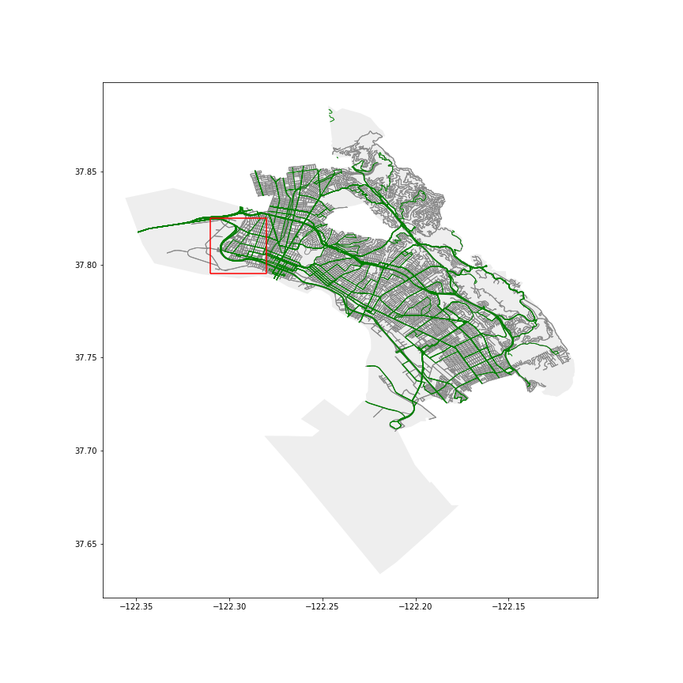
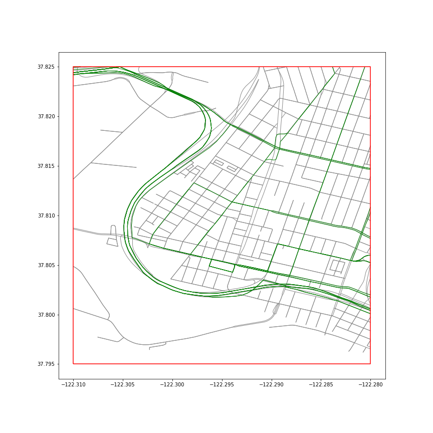
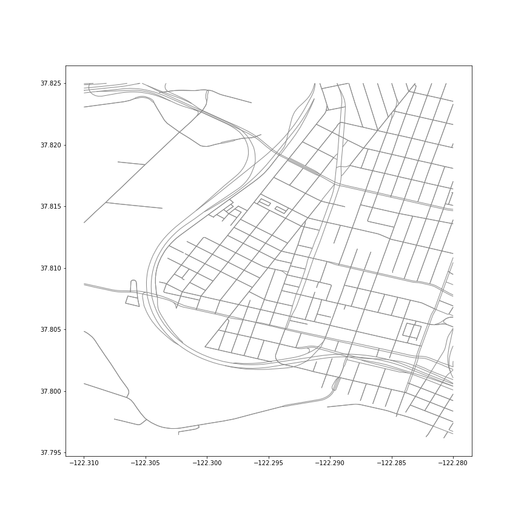
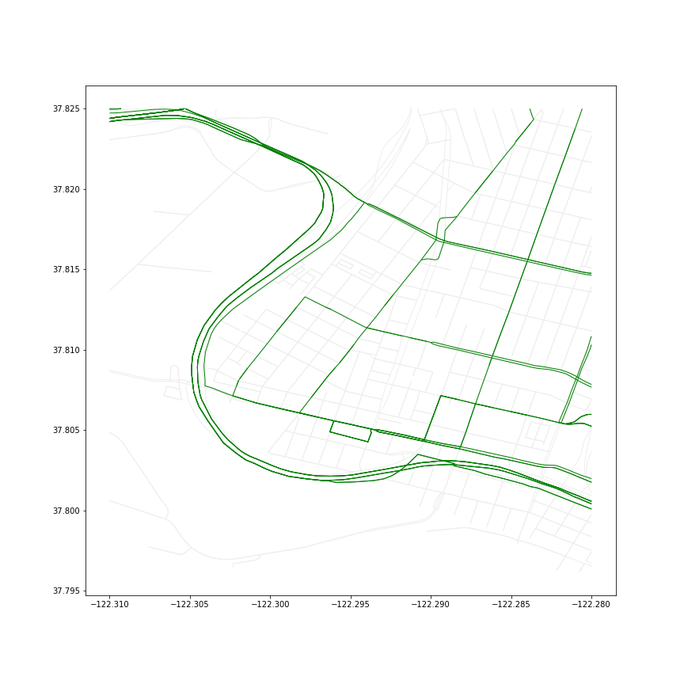
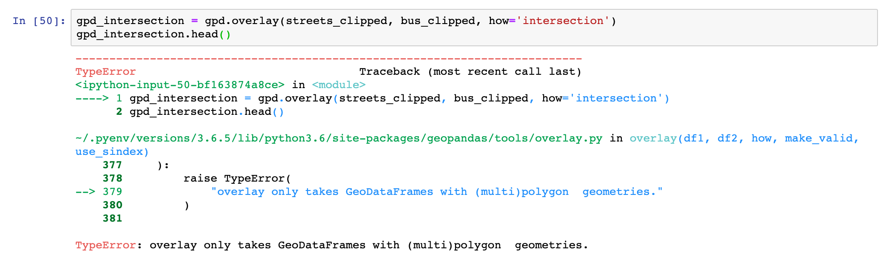
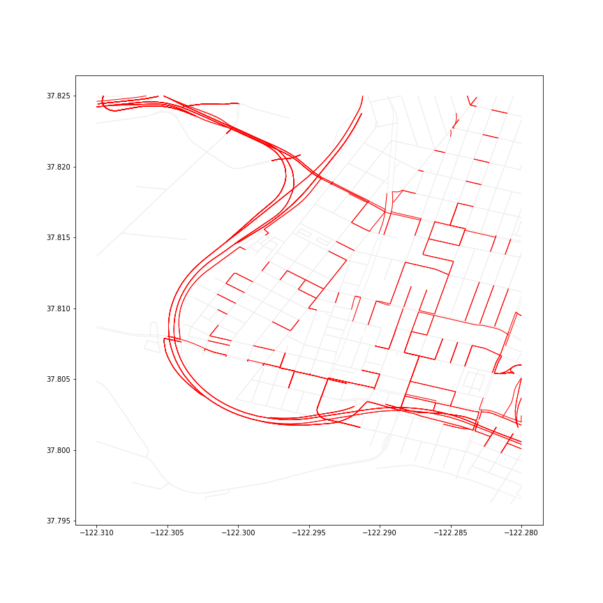
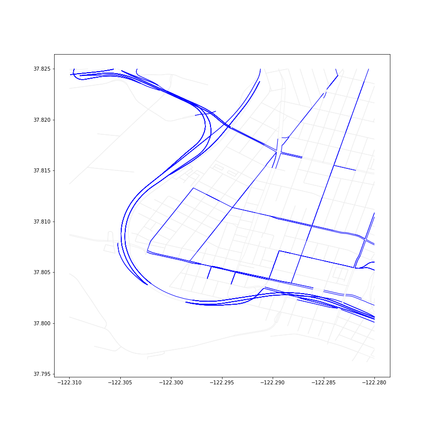

# Geosimilarity

Computes similarity between geometries of two GeoDataFrames

# Problem to solve:
- Slight differences in geometries can make it difficult to perform certain operations such as ```geopandas.overlay(...)```
- This is especially the case for LineStrings

# Real world context:
The images below show two GeoDataFrames from two separate data sources, one representing the streets of the City of Oakland (grey) from [OSMnx](https://github.com/gboeing/osmnx) and one representing the bus routes of a city (green) from the [AC Transit website](http://www.actransit.org/bus-route-gis-shape-files/?did=3)



When zoomed in, see how the green and grey lines largely overlap, but have the slightest misalignments.



These miniscule misalignments can make it so the LineStrings representing the same streets in the physical world are deemed different geometries and thus different streets. Below are the streets and bus routes displayed side by side.

## Original GeoDataFrames

 

## gpd.overlay - not supported

This is what happens when you try to use ```gpd.overlay(...)``` between two LineString GeoDataFrames, which currently only supports Polygon GeoDataFrames:



## gpd.sjoin - messy results
This is what happens when you try to use ```gpd.sjoin(..., how='intersection')```, which produces a lot of false positive intersections:

 

**The question at hand is: How can we easily identify which street LineStrings are very similar (and are likely to represent the same street in the physical world)?**

## geosimilarity.similarity - a new and improved alternative!
By using the geosimilarity CLI and running the following from the terminal:

```
$ bin/geosimilarity similarity data/bus_clipped/bus_clipped.shp data/streets_clipped/streets_clipped.shp --max_rows=3 -d geometry_x --clip_max=0.1 --rf="data/bus_streets_similarity.shp"

Columns ['geometry_x'] dropped from result.

+----------+-----------+---------------------------------------------------------------------------------------------------------------------------------------------------------------------------------------------------------------------+-----------+-----------+--------------------+
|          |   value_y | geometry_y                                                                                                                                                                                                          |   index_x |   value_x |   similarity_score |
|----------+-----------+---------------------------------------------------------------------------------------------------------------------------------------------------------------------------------------------------------------------+-----------+-----------+--------------------|
| (0, 515) |         1 | LINESTRING (-122.2982572 37.8059792, -122.2980441 37.8059234, -122.2979901 37.8059093, -122.2978033 37.8058744, -122.2975446 37.8058411, -122.2973577 37.8058121, -122.2971652 37.8057709, -122.2970636 37.8057943) |         0 |         1 |           0.720063 |
| (0, 223) |         1 | LINESTRING (-122.2970636 37.8057943, -122.2971417 37.8058519, -122.2972276 37.8058709, -122.2977915 37.8060014, -122.2979687 37.8060425, -122.2980113 37.8060524, -122.2981685 37.8060889)                          |         0 |         1 |           0.375816 |
| (0, 514) |         1 | LINESTRING (-122.2982572 37.8059792, -122.2981685 37.8060889)                                                                                                                                                       |         0 |         1 |           0        |
+----------+-----------+---------------------------------------------------------------------------------------------------------------------------------------------------------------------------------------------------------------------+-----------+-----------+--------------------+
Result saved to data/bus_streets_similarity.shp

```

The result saved to ```data/bus_streets_similarity.shp``` contains the following GeoDataFrame, which when filtered by ```similarity_score``` using the following line ```plot = bus_streets_similarity[bus_streets_similarity['similarity'].astype(float) > 0.6]```, produces the following map.

 

Although it still does not produce a perfect result and the parameters could be more easily tweaked, this is progress from the existing geopandas operations and hopefully will improve with more contributions.

# Implementation
- Combines two GeoDataFrames and computes the similarity_score between the geometries of each GeoDataFrame
- The similarity_score, which ranges from 0.0 (completely dissimilar) to 1.0 (completely similar), is determined based on the Frechet distance using the formula ```e^(-frechet/line.length)```
- More on Frechet distance can be found [here](https://en.wikipedia.org/wiki/Fr%C3%A9chet_distance)

# Set up

```
$ git clone https://github.com/ukyerdua/geosimilarity.git
$ cd geosimilarity
$ pip3 install -r requirements.txt
$ export PYTHONPATH="$PWD/geosimilarity"
```

If you do not set the ```PYTHONPATH``` to ```geosimilarity/geosimilarity/```, then the test files will not be able to read the functions to be tested in ```geosimilarity/geosimilarity/*.py```

# Run CLI
## To see functions (Commands) available:

```
$ bin/geosimilarity
```

```
$ bin/geosimilarity
Usage: main.py [OPTIONS] COMMAND [ARGS]...

Options:
  --help  Show this message and exit.

Commands:
  compare                     Calls geosimilarity/compare.py using input...
  flatten-multilinestring-df  Converts a GeoDataFrame with MultiLineStrings...
  line-to-coords              Converts (Multi)LineString to 2d-array of...
  print-gdf                   Print tabulated GeoDataFrame.
  similarity                  Calls geosimilarity/similarity.py using input...
```

## To run "compare" on two LineStrings

```
$ bin/geosimilarity compare [filepath] [--method='frechet_dist'] [--precision=6] [--clip=True] [--clip_max=0.5]
```

```filepath``` must contain a file containing two lines, each containing a LineString of the following format ```LINESTRING (0 0, 1 1, 2 2)```. See below for example.

**Use --help to see descriptions of options**

```
$ bin/geosimilarity compare --help
```

```
$ bin/geosimilarity compare --help
Usage: main.py compare [OPTIONS] FILEPATH

  Calls geosimilarity/compare.py using input from the CLI
  ...(docstring abridged)...

Options:
  --method [frechet_dist]  Which similarity measure to use calculate
                           similarity_score. Currently supports 'frechet_dist'
  --precision INTEGER      Decimal precision to round similarity_score.
                           Default=6.
  --clip BOOLEAN           If True, the similarity_score will be calculated
                           based on the clipped portion of the original
                           geometries within the intersection of each
                           geometry's bounding box. If False, the
                           similarity_score will compare the entirety of the
                           original geometries.
  --clip_max FLOAT RANGE   The minimum ratio of length of the clipped geometry
                           to the length of the original geometry, at which to
                           return a non-zero similarity_score.
  --help                   Show this message and exit.
```

**Example:**

```
$ touch test
$ vim test
```
In vim:
- press _i_ to Insert text
- write two lines, each containing LineStrings with the following format
    ```
    LINESTRING (0 0, 1 1, 2 2)
    LINESTRING (0 0.01, 1 1.01, 2 2.01)
    ```
- press _esc_ 
- type _:wq_ and press _enter_ to save and exit vim
```
$ bin/geosimilarity compare test --precision=8

The similarity score between "LINESTRING (0 0, 1 1, 2 2)" and "LINESTRING (0 0.01, 1 1.01, 2 2.01)" is: 
0.99647071
```

## To run "similarity" on two GeoDataFrames

```
$ bin/geosimilarity similarity [filepath1] [filepath2] [--rf=''] [--drop_col=''] [--how='sindex'] [--drop_zeroes=False] [--keep_geom='left'] [--method='frechet_dist'] [--precision=6] [--clip=True] [--clip_max=0.5]
```

```filepath1``` and ```filepath2``` must contain a ```*.shp``` file with its corresponding ```*.cpg```, ```*.dbf```, ```*.prj```, and ```*.shx``` files in the same directory to be read by ```geopandas.read_file(*.shp)```. 

If you want to save the result table to a file, you must provide a filepath to ```--rf``` that ends in ```*.csv``` or ```*.shp``` (to save to ```*.shp```, you must either set ```--drop_col``` to ```geometry_x``` or ```geometry_y``` because shapefiles can only support one geometry column).

**Use --help to see descriptions of options**

```
$ bin/geosimilarity similarity --help
```

```
$ bin/geosimilarity similarity --help
Usage: main.py similarity [OPTIONS] FILEPATH1 FILEPATH2

  Calls geosimilarity/similarity.py using input from the
  CLI
  ...(docstring abridged)...
  
Options:
  --rf PATH                       Filepath to store result dataframe.
  -d, --drop_col TEXT             Columns to drop before saving result
                                  GeoDataFrame to file (multiple columns
                                  allowed: -d col1 -d col2).
  --how [sindex|cartesian]        'sindex' to merge GeoDataFrames on spatial
                                  index, 'cartesian' to merge by cartesian
                                  product.
  --drop_zeroes BOOLEAN           If True, rows in the result GeoDataFrame
                                  with a similarity_score of 0 will be
                                  dropped.
  --keep_geom [geometry_x|geometry_y]
                                  'left' and 'right' to set geometry column in
                                  result GeoDataFrame to df1's and df2's
                                  original geometry column, respectively.
  --max_rows INTEGER              Max rows of result GeoDataFrame to print.
  --method [frechet_dist]         Which similarity measure to use calculate
                                  similarity_score. Currently supports
                                  'frechet_dist'
  --precision INTEGER             Decimal precision to round similarity_score.
                                  Default=6.
  --clip BOOLEAN                  If True, the similarity_score will be
                                  calculated based on the clipped portion of
                                  the original geometries within the
                                  intersection of each geometry's bounding
                                  box. If False, the similarity_score will
                                  compare the entirety of the original
                                  geometries.
  --clip_max FLOAT RANGE          The minimum ratio of length of the clipped
                                  geometry to the length of the original
                                  geometry, at which to return a non-zero
                                  similarity_score.
  --help                          Show this message and exit.
```

**Example 1: Save to shapefile and drop geometry_y**

```
$ bin/geosimilarity similarity data/line1/line1.shp data/line1_distance_gradient/line1_distance_gradient.shp --rf='data/result.shp' --drop_col=geometry_y

Columns ['geometry_y'] dropped from result.
+--------+-----------+-----------+-----------------------------------------------------------+--------------------+
|        |   value_y |   value_x | geometry_x                                                |   similarity_score |
|--------+-----------+-----------+-----------------------------------------------------------+--------------------|
| (0, 1) |         1 |         1 | LINESTRING (-122.3 37.82, -122.31 37.825, -122.32 37.822) |           0.954801 |
| (0, 0) |         1 |         1 | LINESTRING (-122.3 37.82, -122.31 37.825, -122.32 37.822) |           1        |
| (0, 3) |         1 |         1 | LINESTRING (-122.3 37.82, -122.31 37.825, -122.32 37.822) |           0        |
| (0, 2) |         1 |         1 | LINESTRING (-122.3 37.82, -122.31 37.825, -122.32 37.822) |           0        |
+--------+-----------+-----------+-----------------------------------------------------------+--------------------+
Result saved to data/result.shp

```

**Example 2: Save to csv and keep both geometry columns**

```
$ bin/geosimilarity similarity data/line1/line1.shp data/line1_distance_gradient/line1_distance_gradient.shp --rf='data/result2.csv' 

+--------+-----------+-----------------------------------------------------------------+-----------+-----------------------------------------------------------+--------------------+
|        |   value_y | geometry_y                                                      |   value_x | geometry_x                                                |   similarity_score |
|--------+-----------+-----------------------------------------------------------------+-----------+-----------------------------------------------------------+--------------------|
| (0, 1) |         1 | LINESTRING (-122.3 37.8205, -122.3105 37.825, -122.3205 37.822) |         1 | LINESTRING (-122.3 37.82, -122.31 37.825, -122.32 37.822) |           0.954801 |
| (0, 0) |         1 | LINESTRING (-122.3 37.82, -122.31 37.825, -122.32 37.822)       |         1 | LINESTRING (-122.3 37.82, -122.31 37.825, -122.32 37.822) |           1        |
| (0, 3) |         1 | LINESTRING (-122.3 37.824, -122.31 37.829, -122.32 37.826)      |         1 | LINESTRING (-122.3 37.82, -122.31 37.825, -122.32 37.822) |           0        |
| (0, 2) |         1 | LINESTRING (-122.3 37.822, -122.31 37.827, -122.319 37.824)     |         1 | LINESTRING (-122.3 37.82, -122.31 37.825, -122.32 37.822) |           0        |
+--------+-----------+-----------------------------------------------------------------+-----------+-----------------------------------------------------------+--------------------+
Result saved to data/result2.csv

```

**Example 3: Unsuccessfully attempt to save to shp AND keep both geometry columns**


```
$ bin/geosimilarity similarity data/line1/line1.shp data/line1_distance_gradient/line1_distance_gradient.shp --rf='data/result3.shp' 

+--------+-----------+-----------------------------------------------------------------+-----------+-----------------------------------------------------------+--------------------+
|        |   value_y | geometry_y                                                      |   value_x | geometry_x                                                |   similarity_score |
|--------+-----------+-----------------------------------------------------------------+-----------+-----------------------------------------------------------+--------------------|
| (0, 1) |         1 | LINESTRING (-122.3 37.8205, -122.3105 37.825, -122.3205 37.822) |         1 | LINESTRING (-122.3 37.82, -122.31 37.825, -122.32 37.822) |           0.954801 |
| (0, 0) |         1 | LINESTRING (-122.3 37.82, -122.31 37.825, -122.32 37.822)       |         1 | LINESTRING (-122.3 37.82, -122.31 37.825, -122.32 37.822) |           1        |
| (0, 3) |         1 | LINESTRING (-122.3 37.824, -122.31 37.829, -122.32 37.826)      |         1 | LINESTRING (-122.3 37.82, -122.31 37.825, -122.32 37.822) |           0        |
| (0, 2) |         1 | LINESTRING (-122.3 37.822, -122.31 37.827, -122.319 37.824)     |         1 | LINESTRING (-122.3 37.82, -122.31 37.825, -122.32 37.822) |           0        |
+--------+-----------+-----------------------------------------------------------------+-----------+-----------------------------------------------------------+--------------------+
Result not saved to file.
Only one geometry column is allowed to save to *.shp.
Please set --drop_col (-d) to either geometry_x or geometry_y.

```

## Other helper methods
### print_gdf

```
$ bin/geosimilarity print-gdf [filepath] [--max_rows=None]
```

```
$ bin/geosimilarity print-gdf --help
Usage: main.py print-gdf [OPTIONS] FILEPATH

  Print tabulated GeoDataFrame.

Options:
  --max_rows INTEGER  Max rows of result GeoDataFrame to print.
  --help              Show this message and exit.
 ```

**Example**
```
$ bin/geosimilarity print-gdf data/bus_clipped/bus_clipped.shp --max_rows=1


+----+---------+------------------------------------------------------------------------------------------------------------------------------------------------------------------------------------------------------------------------------------------------------------------------------------------------------------------------------------------------------------------------------------------------------------------------------------------------------------------------------------------------------------------------------------------------------------------------------------------------------------------------------------------------------------------------------------------------------------------------------------------------------------------------------------------------------------------------------------------------------------------------------------------------------------------------------------------------------------------------------------------------------------------------------------------------------------------------------------------------------------------------------------------------------------------------------------------------------------------------------------------------------------------------------------------------------------------------------------------------------------------------------------------------------------------------------------------------------------------------------------------------------------------------------------------------------------------------------------------------------------------------------------------------------------------------------------------------------------------------------------------------------------------------------------------------------------------------------------------------------------------------------------------------------------------------------------------------------------------------------------------------------------------------------------------------------------------------------------------------------------------------------------------------------------------------------------------------------------------------------------------------------------------------------------------------------------------------------------------------------------------------------------------------------------------------------------------------------------------------------------------------------------------------------------------------------------------------------------------------------------------------------------------------------------------------------------------------------------------------------------------------------------------------------------------------------------------------------------------------------------------------------------------------------------------------------------------------------------------------------------------------------------------------------------------------------------------------------------------------------------------------------------------------------------------------------------------------------------------------------------------------------------------------------------------------------------------------------------------------------------------------------------------------------------------------------------------------------------------------------------------------------------------------------------------------------------------------------------------------------------------------------------------------------------------------------------------------------------------------------------------------------------------------------------------------------------------------------------------------------------------------------------------------------------------------------------------------------------------------------------------------------------------------------------------------------------------------------------------------------------------------------------------------------------------------------------------------------------------------------------------------------------------------------------------------------------------------------------------------------------------------------------------------------------------------------------------------------------------------------------------------------------------------------------------------------------------------------------------------------------------------------------------------------------------------------------------------------------------------------------------------------------------------------------------------------------------------------------------------------------------------------------------------------------------------------------------------------------------------------------------------------------------------------------------------------------------------------------------------------------------------------------------------------------------------------------------------------------------------------------------------------------------------------------------------------------------------------------------------------------------------------------------------------------------------------------------------------------------------------------------------------------------------------------------------------------------------------------------------------------------------------------------------------------------------------------------------------------------------------------------------------------------------------------------------------------------------------------------------------------------------------------------------------------------------------------------------------------------------------------------------------------------------------------------------------------------------------------------------------------------------------------------------------------------------------------------------------------------------------------------------------------------------------------------------------------------------------------------------------------------------------------------------------------------------------------------------------------------------------------------------------------------------------------------------------------------------------------------------------------------------------------------------------------------------------------------------------------------------------------------------------------------------------------------------------------------------------------------------------------------------------------------------------------------------------------------------------------------------------------------------------------------------------------------------------------------------------------------------------------------------------------------------------------------------------------------------------------------------------------------------------------------------------------------+
|    |   value | geometry                                                                                                                                                                                                                                                                                                                                                                                                                                                                                                                                                                                                                                                                                                                                                                                                                                                                                                                                                                                                                                                                                                                                                                                                                                                                                                                                                                                                                                                                                                                                                                                                                                                                                                                                                                                                                                                                                                                                                                                                                                                                                                                                                                                                                                                                                                                                                                                                                                                                                                                                                                                                                                                                                                                                                                                                                                                                                                                                                                                                                                                                                                                                                                                                                                                                                                                                                                                                                                                                                                                                                                                                                                                                                                                                                                                                                                                                                                                                                                                                                                                                                                                                                                                                                                                                                                                                                                                                                                                                                                                                                                                                                                                                                                                                                                                                                                                                                                                                                                                                                                                                                                                                                                                                                                                                                                                                                                                                                                                                                                                                                                                                                                                                                                                                                                                                                                                                                                                                                                                                                                                                                                                                                                                                                                                                                                                                                                                                                                                                                                                                                                                                                                                                                                                                                                                                                                                                                                                                                                                                                                                                                                                                                                                                                                                                                 |
|----+---------+------------------------------------------------------------------------------------------------------------------------------------------------------------------------------------------------------------------------------------------------------------------------------------------------------------------------------------------------------------------------------------------------------------------------------------------------------------------------------------------------------------------------------------------------------------------------------------------------------------------------------------------------------------------------------------------------------------------------------------------------------------------------------------------------------------------------------------------------------------------------------------------------------------------------------------------------------------------------------------------------------------------------------------------------------------------------------------------------------------------------------------------------------------------------------------------------------------------------------------------------------------------------------------------------------------------------------------------------------------------------------------------------------------------------------------------------------------------------------------------------------------------------------------------------------------------------------------------------------------------------------------------------------------------------------------------------------------------------------------------------------------------------------------------------------------------------------------------------------------------------------------------------------------------------------------------------------------------------------------------------------------------------------------------------------------------------------------------------------------------------------------------------------------------------------------------------------------------------------------------------------------------------------------------------------------------------------------------------------------------------------------------------------------------------------------------------------------------------------------------------------------------------------------------------------------------------------------------------------------------------------------------------------------------------------------------------------------------------------------------------------------------------------------------------------------------------------------------------------------------------------------------------------------------------------------------------------------------------------------------------------------------------------------------------------------------------------------------------------------------------------------------------------------------------------------------------------------------------------------------------------------------------------------------------------------------------------------------------------------------------------------------------------------------------------------------------------------------------------------------------------------------------------------------------------------------------------------------------------------------------------------------------------------------------------------------------------------------------------------------------------------------------------------------------------------------------------------------------------------------------------------------------------------------------------------------------------------------------------------------------------------------------------------------------------------------------------------------------------------------------------------------------------------------------------------------------------------------------------------------------------------------------------------------------------------------------------------------------------------------------------------------------------------------------------------------------------------------------------------------------------------------------------------------------------------------------------------------------------------------------------------------------------------------------------------------------------------------------------------------------------------------------------------------------------------------------------------------------------------------------------------------------------------------------------------------------------------------------------------------------------------------------------------------------------------------------------------------------------------------------------------------------------------------------------------------------------------------------------------------------------------------------------------------------------------------------------------------------------------------------------------------------------------------------------------------------------------------------------------------------------------------------------------------------------------------------------------------------------------------------------------------------------------------------------------------------------------------------------------------------------------------------------------------------------------------------------------------------------------------------------------------------------------------------------------------------------------------------------------------------------------------------------------------------------------------------------------------------------------------------------------------------------------------------------------------------------------------------------------------------------------------------------------------------------------------------------------------------------------------------------------------------------------------------------------------------------------------------------------------------------------------------------------------------------------------------------------------------------------------------------------------------------------------------------------------------------------------------------------------------------------------------------------------------------------------------------------------------------------------------------------------------------------------------------------------------------------------------------------------------------------------------------------------------------------------------------------------------------------------------------------------------------------------------------------------------------------------------------------------------------------------------------------------|
|  0 |       1 | MULTILINESTRING ((-122.298192 37.806064, -122.297088 37.805812), (-122.297088 37.805812, -122.297962 37.806013, -122.298192 37.806064), (-122.293705 37.805059, -122.293747 37.804943, -122.29371 37.804825, -122.293869 37.804394, -122.293914 37.804262, -122.294719 37.804475, -122.295099 37.804573, -122.295573 37.804698, -122.295576 37.804698, -122.29629 37.804885, -122.296134 37.80531, -122.296037 37.805573), (-122.293444 37.804997, -122.293447 37.804997, -122.293559 37.805025, -122.293628 37.805041, -122.293705 37.805059), (-122.296037 37.805573, -122.296034 37.805573, -122.294916 37.805329, -122.293796 37.805079, -122.293705 37.805059), (-122.296037 37.805573, -122.297088 37.805812), (-122.28815 37.803959, -122.288069 37.804183, -122.287828 37.804843), (-122.287828 37.804843, -122.28815 37.803959), (-122.293444 37.804997, -122.293373 37.804932, -122.293216 37.804874, -122.292318 37.804698, -122.292064 37.804644, -122.291497 37.804524, -122.290422 37.804293, -122.290418 37.804293, -122.290164 37.804236, -122.289325 37.804046, -122.28823 37.803832, -122.288197 37.803895, -122.28815 37.803959), (-122.28815 37.803959, -122.288351 37.803995, -122.289294 37.804162, -122.290407 37.804395, -122.290867 37.804503, -122.291643 37.804684, -122.292311 37.804819, -122.292767 37.804914, -122.293316 37.805018, -122.29332 37.805018, -122.293444 37.804997), (-122.300866 37.806683, -122.301127 37.806761, -122.302338 37.80713), (-122.302338 37.80713, -122.300866 37.806683), (-122.302338 37.80713, -122.3021 37.807735, -122.3021 37.807738), (-122.3021 37.807738, -122.301973 37.808067), (-122.301973 37.808067, -122.302044 37.807882, -122.3021 37.807738), (-122.301973 37.808067, -122.301913 37.808169), (-122.299306 37.806317, -122.300862 37.806683), (-122.298192 37.806064, -122.299306 37.806317), (-122.299306 37.806317, -122.298436 37.806118, -122.298192 37.806064), (-122.287224 37.806629, -122.287288 37.806436, -122.287828 37.804843), (-122.287828 37.804843, -122.287263 37.806519, -122.287224 37.806629), (-122.300862 37.806683, -122.299884 37.806453, -122.299306 37.806317), (-122.300862 37.806683, -122.300866 37.806683), (-122.290246 37.810514, -122.289996 37.810449), (-122.29136 37.810761, -122.291026 37.810687, -122.290246 37.810514), (-122.290246 37.810514, -122.290588 37.810589, -122.29136 37.810761), (-122.291771 37.810854, -122.291768 37.810854, -122.291563 37.810818, -122.29136 37.810761), (-122.299596 37.81113, -122.299118 37.811717, -122.298957 37.811915), (-122.291771 37.810854, -122.292923 37.811116), (-122.292923 37.811116, -122.292732 37.811073, -122.291771 37.810854), (-122.293985 37.811361, -122.292923 37.811116), (-122.292923 37.811116, -122.293679 37.811292, -122.293985 37.811361), (-122.298957 37.811915, -122.299596 37.81113), (-122.284396 37.814416, -122.284396 37.814413), (-122.2841267457636 37.81515047457395, -122.284347 37.814551, -122.284396 37.814416), (-122.284396 37.814416, -122.2841267457636 37.81515047457395), (-122.2841267457636 37.81515047457395, -122.284058 37.815338, -122.284002 37.81549), (-122.284002 37.81549, -122.2841267457636 37.81515047457395), (-122.284798 37.8133, -122.284438 37.814302, -122.284396 37.814413), (-122.284396 37.814413, -122.284798 37.8133), (-122.296222 37.812508, -122.295268 37.812012, -122.294164 37.811433, -122.293985 37.811361), (-122.298957 37.811915, -122.298355 37.812652), (-122.298355 37.812652, -122.298839 37.812059, -122.298957 37.811915), (-122.285631 37.811068, -122.285194 37.812206, -122.285149 37.812328), (-122.285149 37.812328, -122.285559 37.811256, -122.285631 37.811068), (-122.296222 37.812508, -122.296331 37.812556, -122.29654 37.812646), (-122.29654 37.812646, -122.296285 37.812535, -122.296222 37.812508), (-122.298355 37.812652, -122.298355 37.812654, -122.297841 37.813288, -122.297837 37.813291, -122.296544 37.812646, -122.29654 37.812646), (-122.284798 37.8133, -122.285087 37.812496, -122.285149 37.812328), (-122.285149 37.812328, -122.284798 37.8133), (-122.282296 37.820262, -122.282358 37.820094, -122.282615798561 37.81936897841771), (-122.282615798561 37.81936897841771, -122.282338 37.820141, -122.282296 37.820262), (-122.282296 37.820262, -122.281698 37.821884, -122.281652 37.822011), (-122.281652 37.822011, -122.282296 37.820262), (-122.283406 37.817169, -122.282896 37.818591, -122.282854 37.818707), (-122.282854 37.818707, -122.283354 37.817313, -122.283406 37.817169), (-122.282615798561 37.81936897841771, -122.282795 37.818865, -122.282854 37.818707), (-122.282854 37.818707, -122.282615798561 37.81936897841771), (-122.2805823363949 37.825, -122.281025 37.82374), (-122.2813072500019 37.82296316666135, -122.281597 37.82216, -122.281652 37.822011), (-122.281652 37.822011, -122.2813072500019 37.82296316666135), (-122.281025 37.82374, -122.281084 37.823582, -122.2813072500019 37.82296316666135), (-122.2813072500019 37.82296316666135, -122.281064 37.823635, -122.281025 37.82374), (-122.28396 37.815612, -122.2836653137217 37.8164406666774), (-122.28396 37.815612, -122.28398 37.815556, -122.284002 37.81549), (-122.2836653137217 37.8164406666774, -122.283866 37.815877, -122.28396 37.815612), (-122.2836653137217 37.8164406666774, -122.283428 37.817108, -122.283406 37.817169), (-122.283406 37.817169, -122.2836653137217 37.8164406666774), (-122.301407 37.808858, -122.301913 37.808169), (-122.301913 37.808169, -122.301826 37.808289, -122.301407 37.808858), (-122.286167 37.809618, -122.286187 37.809562, -122.286213 37.809488), (-122.286374 37.809024, -122.286261 37.809352, -122.286213 37.809488), (-122.286213 37.809488, -122.286374 37.809024), (-122.286374 37.809024, -122.286702 37.808099, -122.287224 37.806629), (-122.286213 37.809488, -122.285948 37.809426, -122.284037 37.808985, -122.2838 37.80892, -122.283295 37.808826, -122.283101 37.80881, -122.28299 37.8088, -122.282987 37.8088, -122.282643 37.808762, -122.282312 37.808698, -122.28195 37.808602, -122.281574 37.808492, -122.281184 37.808273, -122.280973 37.808155, -122.280872 37.808096, -122.280661 37.807979, -122.28 37.8076623091922), (-122.28 37.80783662295082, -122.280364 37.808002, -122.280817 37.808254, -122.280901 37.808321, -122.281378 37.808553, -122.281895 37.808743, -122.282826 37.80891, -122.282938 37.80893, -122.282941 37.80893, -122.283594 37.809022, -122.283988 37.809126, -122.285039 37.80936, -122.285889 37.809553, -122.286167 37.809618), (-122.289996 37.810449, -122.289914 37.810371, -122.289513 37.81024, -122.289335 37.810204, -122.289071 37.810148, -122.288371 37.809996, -122.288368 37.809996, -122.287292 37.809743, -122.286213 37.809488), (-122.286167 37.809618, -122.28725 37.809865, -122.288329 37.810098, -122.28906 37.81028, -122.289287 37.810337, -122.28983 37.810471, -122.289833 37.810471, -122.289996 37.810449), (-122.301407 37.808858, -122.300805 37.809601, -122.300193 37.810371, -122.299596 37.81113), (-122.285631 37.811068, -122.286063 37.809894, -122.286167 37.809618), (-122.286167 37.809618, -122.28567 37.810963, -122.285631 37.811068)) |
+----+---------+------------------------------------------------------------------------------------------------------------------------------------------------------------------------------------------------------------------------------------------------------------------------------------------------------------------------------------------------------------------------------------------------------------------------------------------------------------------------------------------------------------------------------------------------------------------------------------------------------------------------------------------------------------------------------------------------------------------------------------------------------------------------------------------------------------------------------------------------------------------------------------------------------------------------------------------------------------------------------------------------------------------------------------------------------------------------------------------------------------------------------------------------------------------------------------------------------------------------------------------------------------------------------------------------------------------------------------------------------------------------------------------------------------------------------------------------------------------------------------------------------------------------------------------------------------------------------------------------------------------------------------------------------------------------------------------------------------------------------------------------------------------------------------------------------------------------------------------------------------------------------------------------------------------------------------------------------------------------------------------------------------------------------------------------------------------------------------------------------------------------------------------------------------------------------------------------------------------------------------------------------------------------------------------------------------------------------------------------------------------------------------------------------------------------------------------------------------------------------------------------------------------------------------------------------------------------------------------------------------------------------------------------------------------------------------------------------------------------------------------------------------------------------------------------------------------------------------------------------------------------------------------------------------------------------------------------------------------------------------------------------------------------------------------------------------------------------------------------------------------------------------------------------------------------------------------------------------------------------------------------------------------------------------------------------------------------------------------------------------------------------------------------------------------------------------------------------------------------------------------------------------------------------------------------------------------------------------------------------------------------------------------------------------------------------------------------------------------------------------------------------------------------------------------------------------------------------------------------------------------------------------------------------------------------------------------------------------------------------------------------------------------------------------------------------------------------------------------------------------------------------------------------------------------------------------------------------------------------------------------------------------------------------------------------------------------------------------------------------------------------------------------------------------------------------------------------------------------------------------------------------------------------------------------------------------------------------------------------------------------------------------------------------------------------------------------------------------------------------------------------------------------------------------------------------------------------------------------------------------------------------------------------------------------------------------------------------------------------------------------------------------------------------------------------------------------------------------------------------------------------------------------------------------------------------------------------------------------------------------------------------------------------------------------------------------------------------------------------------------------------------------------------------------------------------------------------------------------------------------------------------------------------------------------------------------------------------------------------------------------------------------------------------------------------------------------------------------------------------------------------------------------------------------------------------------------------------------------------------------------------------------------------------------------------------------------------------------------------------------------------------------------------------------------------------------------------------------------------------------------------------------------------------------------------------------------------------------------------------------------------------------------------------------------------------------------------------------------------------------------------------------------------------------------------------------------------------------------------------------------------------------------------------------------------------------------------------------------------------------------------------------------------------------------------------------------------------------------------------------------------------------------------------------------------------------------------------------------------------------------------------------------------------------------------------------------------------------------------------------------------------------------------------------------------------------------------------------------------------------------------------------------------------------------------------------------------------------------------------------------------------------------------------------------+


```
### flatten_multilinestring_df
```
$ bin/geosimilarity flatten-multilinestring-df [filepath] [--rf=''] [--max_rows=None]
```

```
$ bin/geosimilarity flatten-multilinestring-df --help
Usage: main.py flatten-multilinestring-df [OPTIONS] FILEPATH

  Converts a GeoDataFrame with MultiLineStrings in the geometry column to a
  GeoDataFrame with LineStrings in the geometry column instead. Duplicates
  corresponding column data. Resets index, but keeps old index.

Options:
  --rf PATH           Filepath to store result dataframe.
  --max_rows INTEGER  Max rows of result GeoDataFrame to print.
  --help              Show this message and exit.
```

**Example**
```
$ bin/geosimilarity flatten-multilinestring-df data/bus_clipped/bus_clipped.shp --max_rows=5

+----+---------+---------+----------------------------------------------------------------------------------------------------------------------------------------------------------------------------------------------------------------------------------------------------------------------------------------------+
|    |   index |   value | geometry                                                                                                                                                                                                                                                                                     |
|----+---------+---------+----------------------------------------------------------------------------------------------------------------------------------------------------------------------------------------------------------------------------------------------------------------------------------------------|
|  0 |       0 |       1 | LINESTRING (-122.298192 37.806064, -122.297088 37.805812)                                                                                                                                                                                                                                    |
|  1 |       0 |       1 | LINESTRING (-122.297088 37.805812, -122.297962 37.806013, -122.298192 37.806064)                                                                                                                                                                                                             |
|  2 |       0 |       1 | LINESTRING (-122.293705 37.805059, -122.293747 37.804943, -122.29371 37.804825, -122.293869 37.804394, -122.293914 37.804262, -122.294719 37.804475, -122.295099 37.804573, -122.295573 37.804698, -122.295576 37.804698, -122.29629 37.804885, -122.296134 37.80531, -122.296037 37.805573) |
|  3 |       0 |       1 | LINESTRING (-122.293444 37.804997, -122.293447 37.804997, -122.293559 37.805025, -122.293628 37.805041, -122.293705 37.805059)                                                                                                                                                               |
|  4 |       0 |       1 | LINESTRING (-122.296037 37.805573, -122.296034 37.805573, -122.294916 37.805329, -122.293796 37.805079, -122.293705 37.805059)                                                                                                                                                               |
+----+---------+---------+----------------------------------------------------------------------------------------------------------------------------------------------------------------------------------------------------------------------------------------------------------------------------------------------+

```

### line_to_coords
```
$ bin/geosimilarity line-to-coords [filepath]
```

```
$ bin/geosimilarity line-to-coords --help
Usage: main.py line-to-coords [OPTIONS] FILEPATH

  Converts (Multi)LineString to 2d-array of Point coordinates

Options:
  --rf PATH  Filepath to write result coordinates.
  --help     Show this message and exit.
```

**Example**
```
$ touch test
$ vim test
```
In vim:
- press _i_ to Insert text
- write one line containing a (Multi)LineString with the following format
    ```
    MULTILINESTRING ((0 0, 1 1, 2 2), (3 3, 4 4, 5 5))
    ```
    or
    ```
    LINESTRING (0 0, 1 1, 2 2)
    ```
- press _esc_ 
- type _:wq_ and press _enter_ to save and exit vim
```
$ bin/geosimilarity line-to-coords test


Original LineString: MULTILINESTRING ((0 0, 1 1, 2 2), (3 3, 4 4, 5 5))
Coordinates: [[0.0, 0.0], [1.0, 1.0], [2.0, 2.0], [3.0, 3.0], [4.0, 4.0], [5.0, 5.0]]

```

# Run Tests

```
$ pytest
```

```
$ pytest
================================== test session starts ==================================
platform darwin -- Python 3.6.5, pytest-6.1.0, py-1.9.0, pluggy-0.13.1
rootdir: /Users/audreyku/Desktop/geosimilarity
collected 13 items                                                                                                                                                                                  

tests/test_compare.py .......                                                       [ 53%]
tests/test_linestring_tools.py ...                                                  [ 76%]
tests/test_similarity.py ...                                                        [100%]

=================================== 13 passed in 0.91s ===================================
```

# Sample data files
Some sample data files are provided in ```geosimilarity/data```. ```*.shp``` files are in folders with their corresponding ```*.cpg```, ```*.dbf```, ```*.prj```, and ```*.shx``` files and can be input into the ```similarity method```. The folder ```geosimilarity/data/test_compare_files``` contains text files containing two lines of LineStrings to be input into the ```compare``` method.

See more of the background, ideation, and implementation process in this Notion document:
https://www.notion.so/OSS-Contribution-Geopandas-Overlay-Similar-Geometries-623ac9054c8648b6936ef04793c2899b
