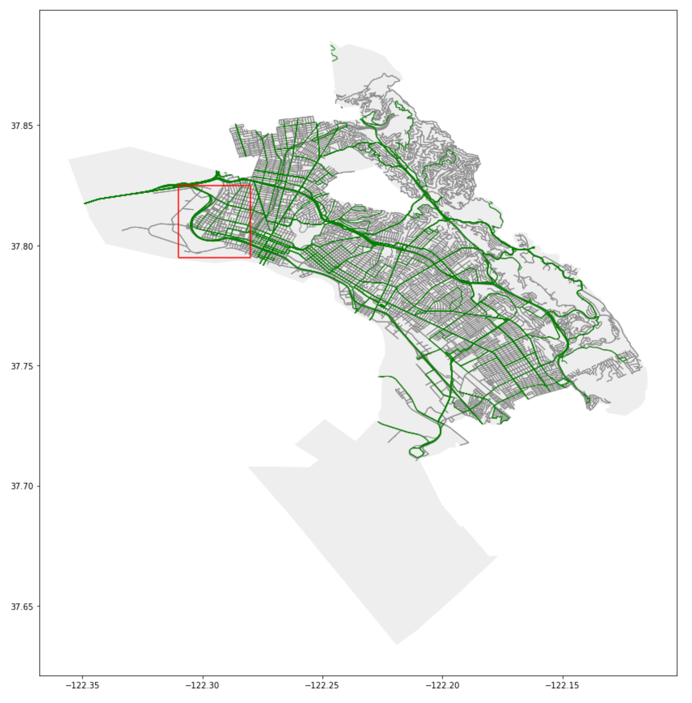
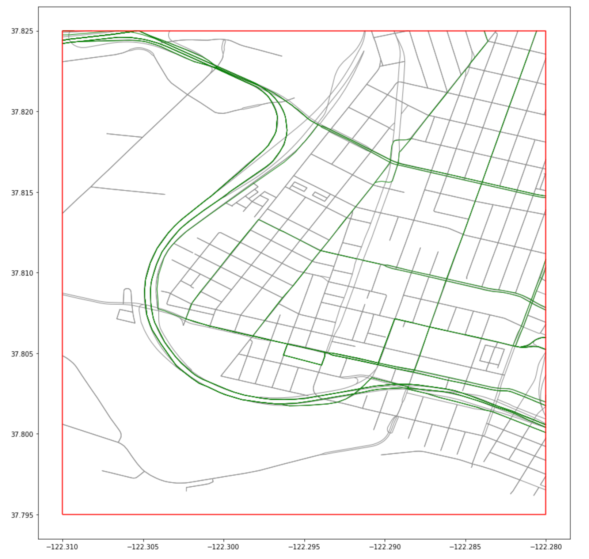

# Geosimilarity

Computes similarity between geometries of two GeoDataFrames

# Problem to solve:
- Slight differences in geometries can make it difficult to perform certain operations such as ```geopandas.overlay(...)```
- This is especially the case for LineStrings

# Real world context:
- The images below show two GeoDataFrames from two separate data sources, one representing the streets of the City of Oakland (grey) from [OSMnx](https://github.com/gboeing/osmnx) and one representing the bus routes of a city (green) from the [AC Transit website](http://www.actransit.org/bus-route-gis-shape-files/?did=3)

- When zoomed in, see how the green and grey lines largely overlap, but have the slightest misalignments

- These miniscule misalignments can make it so the LineStrings representing the same streets in the physical world are deemed different geometries and thus different streets
- The question at hand is: How can we easily identify which street LineStrings are very similar (and are likely to represent the same street in the physical world)?

# Implementation
- Combines two GeoDataFrames and computes the similarity_score between the geometries of each GeoDataFrame
- The similarity_score, which ranges from 0.0 (completely dissimilar) to 1.0 (completely similar), is determined based on the Frechet distance using the formula ```e^(-frechet/line.length)```
- More on Frechet distance can be found [here](https://en.wikipedia.org/wiki/Fr%C3%A9chet_distance)

# Set up

```
$ git clone https://github.com/ukyerdua/geosimilarity.git
$ cd geosimilarity
$ pip3 install -r requirements.txt
$ export PYTHONPATH="$PWD/geosimilarity"
```

If you do not set the ```PYTHONPATH``` to ```geosimilarity/geosimilarity/```, then the test files will not be able to read the functions to be tested in ```geosimilarity/geosimilarity/*.py```

# Run CLI
## To see functions (Commands) available:

```
$ bin/geosimilarity
```

```
$ bin/geosimilarity
Usage: main.py [OPTIONS] COMMAND [ARGS]...

Options:
  --help  Show this message and exit.

Commands:
  compare     Calls geosimilarity/compare.py using input from the CLI...
  similarity  Calls geosimilarity/similarity.py using input from the CLI...
```

## To run "compare" on two LineStrings

```
$ bin/geosimilarity compare [filepath] [--method='frechet_dist'] [--precision=6] [--clip=True] [--clip_max=0.5]
```

```filepath``` must contain a file containing two lines, each containing a LineString of the following format ```LINESTRING (0 0, 1 1, 2 2)```. See below for example.

**Use --help to see descriptions of options**

```
$ bin/geosimilarity compare --help
```

```
$ bin/geosimilarity compare --help
Usage: main.py compare [OPTIONS] FILEPATH

  Calls geosimilarity/compare.py using input from the CLI
  ...(docstring abridged)...

Options:
  --method [frechet_dist]  Which similarity measure to use calculate
                           similarity_score. Currently supports 'frechet_dist'
  --precision INTEGER      Decimal precision to round similarity_score.
                           Default=6.
  --clip BOOLEAN           If True, the similarity_score will be calculated
                           based on the clipped portion of the original
                           geometries within the intersection of each
                           geometry's bounding box. If False, the
                           similarity_score will compare the entirety of the
                           original geometries.
  --clip_max FLOAT RANGE   The minimum ratio of length of the clipped geometry
                           to the length of the original geometry, at which to
                           return a non-zero similarity_score.
  --help                   Show this message and exit.
```

**Example:**

```
$ touch test
$ vim test
```
In vim:
- press _i_ to Insert text
- write two lines, each containing LineStrings with the following format
    ```
    LINESTRING (0 0, 1 1, 2 2)
    LINESTRING (0 0.01, 1 1.01, 2 2.01)
    ```
- press _esc_ 
- type _:wq_ and press _enter_ to save and exit vim
```
$ bin/geosimilarity compare test --precision=8

The similarity score between "LINESTRING (0 0, 1 1, 2 2)" and "LINESTRING (0 0.01, 1 1.01, 2 2.01)" is: 
0.99647071
```

## To run "similarity" on two GeoDataFrames

```
$ bin/geosimilarity similarity [filepath1] [filepath2] [--rf=''] [--drop_col=''] [--how='sindex'] [--drop_zeroes=False] [--keep_geom='left'] [--method='frechet_dist'] [--precision=6] [--clip=True] [--clip_max=0.5]
```

```filepath1``` and ```filepath2``` must contain a ```*.shp``` file with its corresponding ```*.cpg```, ```*.dbf```, ```*.prj```, and ```*.shx``` files in the same directory to be read by ```geopandas.read_file(*.shp)```. 

If you want to save the result table to a file, you must provide a filepath to ```--rf``` that ends in ```*.csv``` or ```*.shp``` (to save to ```*.shp```, you must either set ```--drop_col``` to ```geometry_x``` or ```geometry_y``` because shapefiles can only support one geometry column).

**Use --help to see descriptions of options**

```
$ bin/geosimilarity similarity --help
```

```
$ bin/geosimilarity similarity --help
Usage: main.py similarity [OPTIONS] FILEPATH1 FILEPATH2

  Calls geosimilarity/similarity.py using input from the
  CLI
  ...(docstring abridged)...
  
Options:
  --rf PATH                       Filepath to store result dataframe.
  -d, --drop_col TEXT             Columns to drop before saving result
                                  GeoDataFrame to file (multiple columns
                                  allowed: -d col1 -d col2).
  --how [sindex|cartesian]        'sindex' to merge GeoDataFrames on spatial
                                  index, 'cartesian' to merge by cartesian
                                  product.
  --drop_zeroes BOOLEAN           If True, rows in the result GeoDataFrame
                                  with a similarity_score of 0 will be
                                  dropped.
  --keep_geom [geometry_x|geometry_y]
                                  'left' and 'right' to set geometry column in
                                  result GeoDataFrame to df1's and df2's
                                  original geometry column, respectively.
  --method [frechet_dist]         Which similarity measure to use calculate
                                  similarity_score. Currently supports
                                  'frechet_dist'
  --precision INTEGER             Decimal precision to round similarity_score.
                                  Default=6.
  --clip BOOLEAN                  If True, the similarity_score will be
                                  calculated based on the clipped portion of
                                  the original geometries within the
                                  intersection of each geometry's bounding
                                  box. If False, the similarity_score will
                                  compare the entirety of the original
                                  geometries.
  --clip_max FLOAT RANGE          The minimum ratio of length of the clipped
                                  geometry to the length of the original
                                  geometry, at which to return a non-zero
                                  similarity_score.
  --help                          Show this message and exit.
```

**Example 1: Save to shapefile and drop geometry_y**

```
$ bin/geosimilarity similarity data/line1/line1.shp data/line1_distance_gradient/line1_distance_gradient.shp --rf='data/result.shp' --drop_col=geometry_y

Columns ['geometry_y'] dropped from result.
+--------+-----------+-----------+-----------------------------------------------------------+--------------------+
|        |   value_y |   value_x | geometry_x                                                |   similarity_score |
|--------+-----------+-----------+-----------------------------------------------------------+--------------------|
| (0, 1) |         1 |         1 | LINESTRING (-122.3 37.82, -122.31 37.825, -122.32 37.822) |           0.954801 |
| (0, 0) |         1 |         1 | LINESTRING (-122.3 37.82, -122.31 37.825, -122.32 37.822) |           1        |
| (0, 3) |         1 |         1 | LINESTRING (-122.3 37.82, -122.31 37.825, -122.32 37.822) |           0        |
| (0, 2) |         1 |         1 | LINESTRING (-122.3 37.82, -122.31 37.825, -122.32 37.822) |           0        |
+--------+-----------+-----------+-----------------------------------------------------------+--------------------+
Result saved to data/result.shp

```

**Example 2: Save to csv and keep both geometry columns**

```
$ bin/geosimilarity similarity data/line1/line1.shp data/line1_distance_gradient/line1_distance_gradient.shp --rf='data/result2.csv' 

+--------+-----------+-----------------------------------------------------------------+-----------+-----------------------------------------------------------+--------------------+
|        |   value_y | geometry_y                                                      |   value_x | geometry_x                                                |   similarity_score |
|--------+-----------+-----------------------------------------------------------------+-----------+-----------------------------------------------------------+--------------------|
| (0, 1) |         1 | LINESTRING (-122.3 37.8205, -122.3105 37.825, -122.3205 37.822) |         1 | LINESTRING (-122.3 37.82, -122.31 37.825, -122.32 37.822) |           0.954801 |
| (0, 0) |         1 | LINESTRING (-122.3 37.82, -122.31 37.825, -122.32 37.822)       |         1 | LINESTRING (-122.3 37.82, -122.31 37.825, -122.32 37.822) |           1        |
| (0, 3) |         1 | LINESTRING (-122.3 37.824, -122.31 37.829, -122.32 37.826)      |         1 | LINESTRING (-122.3 37.82, -122.31 37.825, -122.32 37.822) |           0        |
| (0, 2) |         1 | LINESTRING (-122.3 37.822, -122.31 37.827, -122.319 37.824)     |         1 | LINESTRING (-122.3 37.82, -122.31 37.825, -122.32 37.822) |           0        |
+--------+-----------+-----------------------------------------------------------------+-----------+-----------------------------------------------------------+--------------------+
Result saved to data/result2.csv

```

**Example 3: Unsuccessfully attempt to save to shp AND keep both geometry columns**


```
$ bin/geosimilarity similarity data/line1/line1.shp data/line1_distance_gradient/line1_distance_gradient.shp --rf='data/result3.shp' 

+--------+-----------+-----------------------------------------------------------------+-----------+-----------------------------------------------------------+--------------------+
|        |   value_y | geometry_y                                                      |   value_x | geometry_x                                                |   similarity_score |
|--------+-----------+-----------------------------------------------------------------+-----------+-----------------------------------------------------------+--------------------|
| (0, 1) |         1 | LINESTRING (-122.3 37.8205, -122.3105 37.825, -122.3205 37.822) |         1 | LINESTRING (-122.3 37.82, -122.31 37.825, -122.32 37.822) |           0.954801 |
| (0, 0) |         1 | LINESTRING (-122.3 37.82, -122.31 37.825, -122.32 37.822)       |         1 | LINESTRING (-122.3 37.82, -122.31 37.825, -122.32 37.822) |           1        |
| (0, 3) |         1 | LINESTRING (-122.3 37.824, -122.31 37.829, -122.32 37.826)      |         1 | LINESTRING (-122.3 37.82, -122.31 37.825, -122.32 37.822) |           0        |
| (0, 2) |         1 | LINESTRING (-122.3 37.822, -122.31 37.827, -122.319 37.824)     |         1 | LINESTRING (-122.3 37.82, -122.31 37.825, -122.32 37.822) |           0        |
+--------+-----------+-----------------------------------------------------------------+-----------+-----------------------------------------------------------+--------------------+
Result not saved to file.
Only one geometry column is allowed to save to *.shp.
Please set --drop_col (-d) to either geometry_x or geometry_y.

```

# Run Tests

```
$ pytest
```

```
$ pytest
================================== test session starts ==================================
platform darwin -- Python 3.6.5, pytest-6.1.0, py-1.9.0, pluggy-0.13.1
rootdir: /Users/audreyku/Desktop/geosimilarity
collected 13 items                                                                                                                                                                                  

tests/test_compare.py .......                                                       [ 53%]
tests/test_linestring_tools.py ...                                                  [ 76%]
tests/test_similarity.py ...                                                        [100%]

=================================== 13 passed in 0.91s ===================================
```

# Sample data files
Some sample data files are provided in ```geosimilarity/data```. ```*.shp``` files are in folders with their corresponding ```*.cpg```, ```*.dbf```, ```*.prj```, and ```*.shx``` files and can be input into the ```similarity method```. The folder ```geosimilarity/data/test_compare_files``` contains text files containing two lines of LineStrings to be input into the ```compare``` method.

See more of the background, ideation, and implementation process in this Notion document:
https://www.notion.so/OSS-Contribution-Geopandas-Overlay-Similar-Geometries-623ac9054c8648b6936ef04793c2899b
